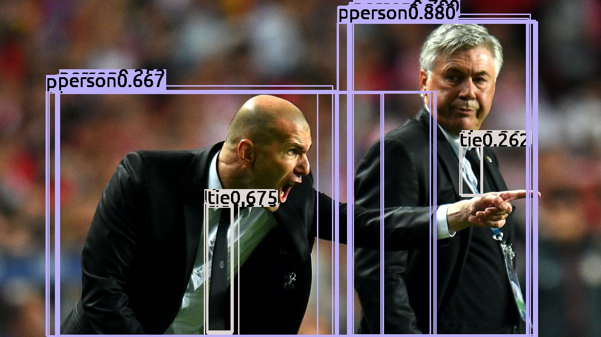
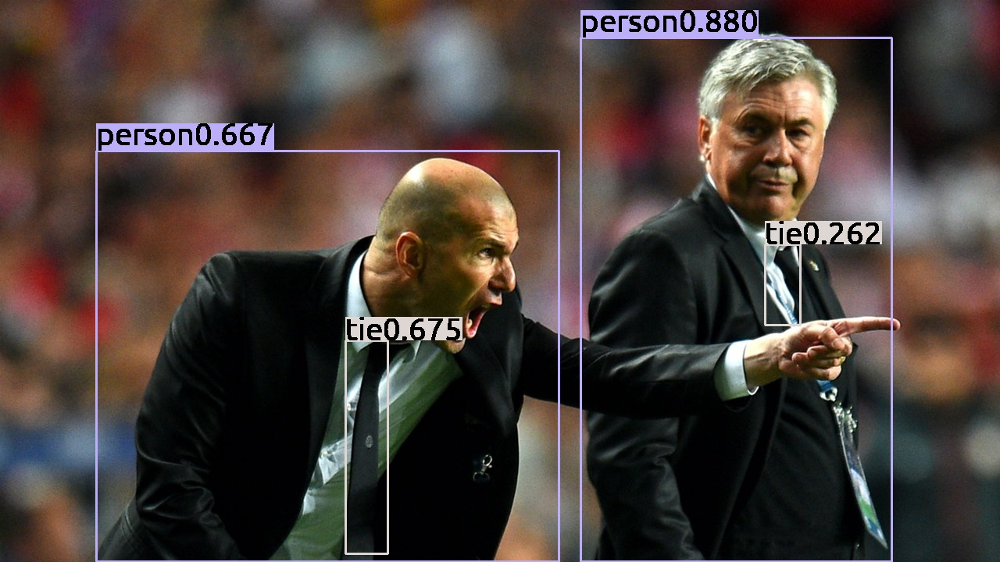

# Modern-Cpp-NMS

A Modern C++ implementation of Non-maximum Suppression(NMS) for Object Detection Algorithms

***Python is used for visualization.***

# Results

## Without NMS

41 Boxes

## With NMS

4 Boxes

# References

[Erase–remove idiom](https://en.wikipedia.org/wiki/Erase%E2%80%93remove_idiom)
